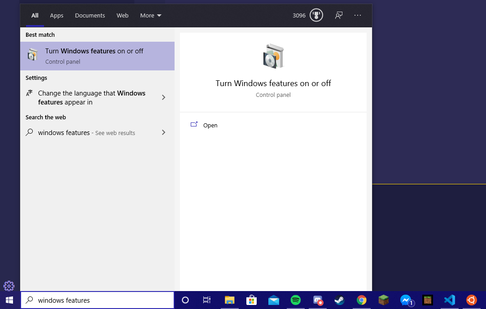
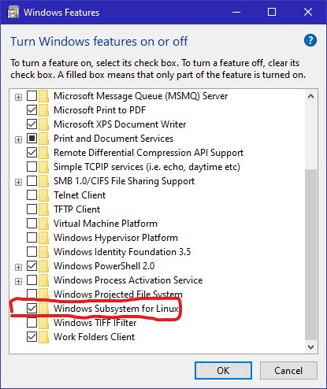
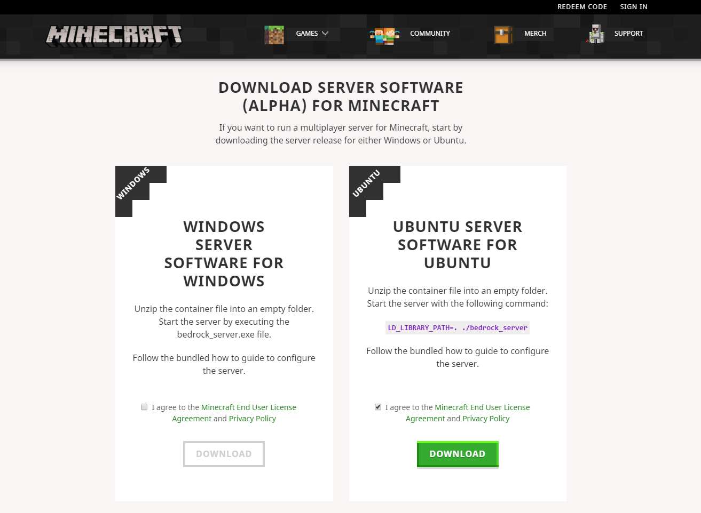

# Bedrock Server Manager

This project is inteded to design a program that will allow multiple Minecraft Bedrock servers to run on a single computer and select which server to access at runtime.

Built and tested on WSL: Ubuntu 20.04 and Ubuntu 20 VM on VMware.

## To begin working

    Note: This guide is primarily aimed towards those inexperienced with Linux and git and assumes the user is following it in its entirety. If you have expeerience with these, you should be able to skip to "Run the setup script" and continue from there, applying the steps to your particular setup. 

### Enable the Windows Subsystem for Linux

1. Search for "windows features" on your PC

2. Scroll until you find the option "Windows Subsytem for Linux"

3. Click the check mark, click ok, and restart.

    Alternatively, you can make a virtual machine or use Ubuntu as your primary OS. However if you're new to the Linux world, the Windows Subsytem for Linux is the most convenient way to access Linux functionality.

### Install Ubuntu 20.04 from the Windows Store

Once downloaded, open it and follow the setup instructions.

Note: Ubuntu will start you in a directory called "/home/[username]". You can access the C: drive using the command "cd /mnt/c".

### Clone the git repository

If you don't have git, run the following commands in Ubuntu 20.04.

    sudo apt install git

    git clone https://github.com/zday294/Bedrock_Server_Manager.git 

You should now have the repository available in Ubuntu 20.04. If you're unfamiliar with git and github, read [the Git Getting Started Guide](./gitting_started.md)

You will also need to create a GitHub account if you do not already have one.

### Run the setup script

Navigate to your local version of the repository in the Ubuntu 20.04 terminal. Once there, run the following commands.

    sudo chmod +x setup
    sudo ./setup

This will run a script to install the Python interpreter for Ubuntu 20.04 and the python linter which helps you find errors.

### Download a copy of the Bedrock server

Go to [the official download page on the Minecraft website,](https://www.minecraft.net/en-us/download/server/bedrock/) and download the Ubuntu Server Software for Ubuntu.

Note: The folder names and locations in the next few steps are crucial to ensuring the code will work across the repository. Pay careful attention.

Move the zip file from where you downloaded it to the git respository. Assuming you dowloaded it to a place in the C drive, the easiest way to do this is to navigate the git repository in Ubuntu 20.04 and then copy it to there with the following command.

    cp /mnt/c/<full path to the zip archive from the C drive>  ./Bedrock_Servers/test_prime

Navigate to test_prime and unzip the archive using the unzip utility. If it asks about conflicts between a file from the zip archive and a file from the repository, opt for the repository version. Doing this should synchronize the server data so that everyone is operating on the same Minecraft world.
