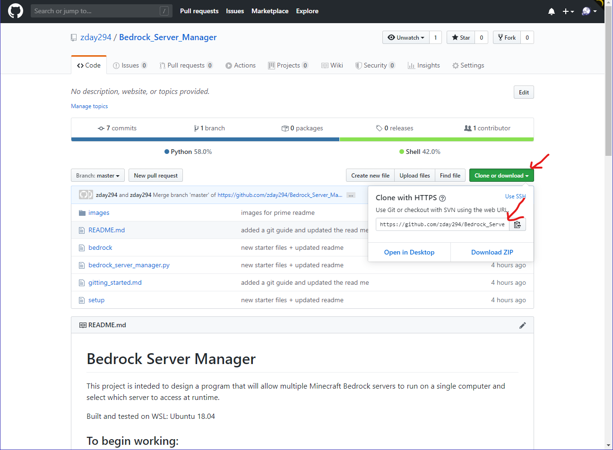

# Getting Started with Git
 
This file is intended to give a brief overview of what you need to know to efffectively utilize git and github. 

## What is git?

Git is a "distributed version control system", which basically means it's a program that saves older versions of folders and allows you to save files in a remote centralized location.

## Installing git

If you're using linux, installing git is as simple as running the following command.

    sudo apt-get git

## Cloning the repository

Working with git begins with creating or cloning a repository. Most of the time you'll be cloning a repository so we'll go over that.

1. Find the link of the repository you want to clone.

    Note: The link usually isn't going to be link of the page you're one. Instead it will be somewhere else on the page. On GitHub, you'll see a "Clone or download" button at the top right of the list of files in the repository. When you click it, a dropdown will appear with a link. This is the link you need to clone the respository.

2. Open the terminal and navigate to the directory where you want the repository.

3. Type "git clone" followed by the link and press enter. Git will ask you for your github login credentials to verify your access permissions.

## The Git Workflow

Once you have a repository, you will have a few main commands that you use as you collaborate.

### Status

The status command shows you what files have been changed since your last commit. It checks both the remote branch and your local branch for changes.

    git status

### Add

When you create a new file or change a file, you can prepare the file to be sychronized with the remote branch by adding it. You can add multiple files with one use of the command.

    git add filename.txt otherfile.md

### Commit

Once the changes have been added, send them to the server with the commit command. Use the -m option to include the commit message on the commmand line. Otherwise, git will open up a dialog for you to add the message. Type your message and press Ctrl+X when finished. Press Y and Enter to accept changes and commit. 

    git commit -m "Type your message here. Don't forget the quotes"

### Pull

The pull command pulls the latest commit from the remote branch. If you have uncommitted changes, git will tell you to stash or commit your changes. 

    git pull

## GUI Options

Many options exist to allow GUI access to git functions. Git has its own GUI application as does GitHub. Many code editors have built in git functionality. Ultimately, the key to successfully using git is finding the tools that work best for you, whether that be the basic command line tools or a GUI toolset.